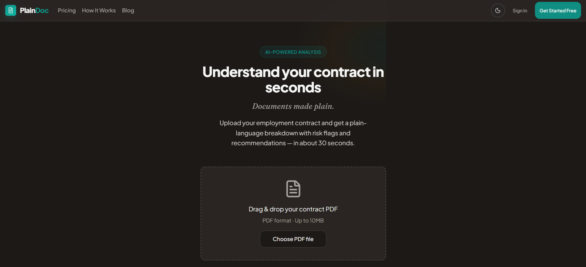

# PlainDoc

AI-powered legal document analyzer for consumers — production SaaS at [plaindoc.app](https://plaindoc.app).

## What it does

Upload an employment contract (PDF or photo) and receive a plain-language
breakdown with risk flags, missing protections, and action recommendations
in about 30 seconds.

## The output

Every clause is rewritten in plain language with risk flags surfaced
inline. Users see what they're signing before they sign it.

## Tech Stack

- **Framework:** Next.js 16 (App Router, Turbopack)
- **Language:** TypeScript (strict)
- **AI:** Claude Sonnet (Anthropic)
- **Database:** Supabase (PostgreSQL)
- **Auth:** Clerk
- **Payments:** PayMongo
- **Rate limiting:** Upstash Redis
- **Hosting:** Vercel

## Pricing

Microtransaction model, processed via PayMongo (GCash, Maya, QR Ph, cards).

## About

Built and operated solo by **Elmar Angao** — Fullstack Developer | AI Integration Specialist.

- Live: [plaindoc.app](https://plaindoc.app)
- Contact: elmarcera@gmail.com
- LinkedIn: [elmar-angao](https://linkedin.com/in/elmar-angao)
